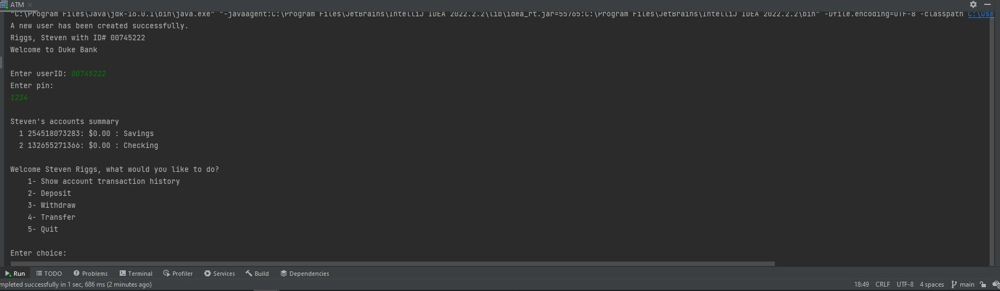
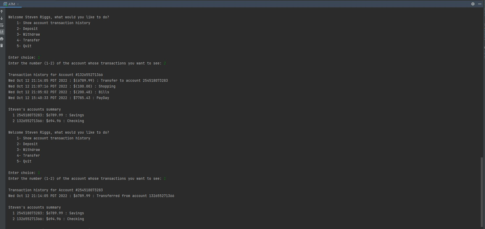
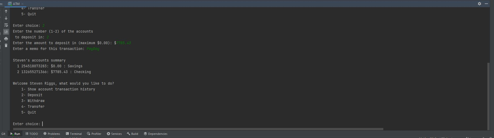
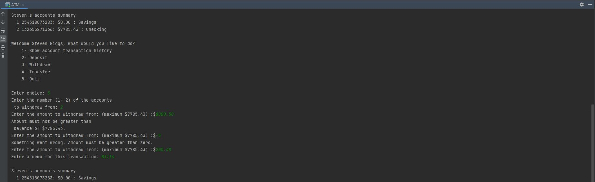
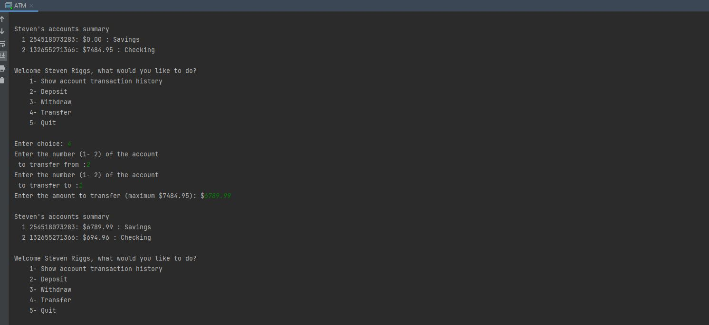

# DukeBank

This is a basic banking application that allows a user to check their bank balance, deposit, withdraw and transfer money. 

The purpose of this repo is to practice many basic Java concepts, like declaring variables, if/else statements, OOP, etc.

ATM Main menu

Showing Account Transaction History

Depositing Funds

Withdrawing Funds

Transferring Funds

